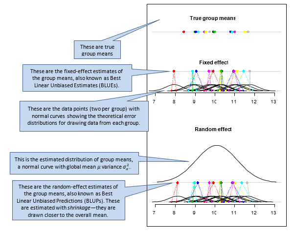

```{r setup, include=FALSE}
knitr::opts_chunk$set(echo = TRUE)
```

# Introduction

In this additional tutorial, we'll play with some code for visualising at the mysterious and wondrous concept of 'shrinkage'. Shrinkage happens when we fit a factor as a random effect, rather than a fixed effect.


**"Shrinkage" describes the shrinkage of estimates of group means toward the overall mean when the grouping factor is treated as a random effect.** 

# Load the code

Source the data in the file `see_fixed_random.R`, available on Stream. 

```{r message=FALSE}
source("see_fixed_random.R")
```

That should load a function called `see_fixed_random()`. 


# Apply the code

Re-run this a few times and you'll see shrinkage in action! 

```{r fig.height=7, fig.width=4, message=FALSE, eval=FALSE}
# adjust figure size to: `fig.height=8, fig.width=5`
par(mfrow=c(2,1), mar=c(5,1,4,1))
see_fixed_random()
```

Here are 10 different runs...

```{r echo=FALSE, fig.height=7, fig.width=4, message=FALSE, animation.hook="gifski", interval=5}
for (i in 1:10) {
  par(mfrow=c(2,1), mar=c(5,1,4,1))
  see_fixed_random()
}
```


Are the random effects estimates of group means closer (shrunk) to 10 than the random effects estimates?


# What does the code do?

The `see_fixed_random(ng=15, nr=2, sd.g=.8, sd.e=.4)` function does the following:

1.	Randomly generates a set of `ng=20` means from a normal distribution with mean 10 and standard deviation `sd.g=.8`. These represent the means of `ng=15` levels of one factor.

2.	Randomly generates `nr=2` replicate data values from each of the `ng=15` groups, with error standard deviation `sd.e=.4`. 

3.	Fits two models: one that fits `group` as a fixed effect and one that fits it as a random effect. 

4.	Generates a plot for each of the models, showing the estimated group means above, with lines joining them to the data points within each group.

The arguments (`ng` = no. groups, `nr` = no. replicates per group, `sd.g` = among-group standard deviation, and `sd.e` = error standard deviation) can be changed.


# Explanation





What is shrinkage? It is one of the most important, but perhaps mysterious, distinctions between fixed and random effects. The BLUPs from the random-effects model tend to be estimated to be closer to the global mean than the BLUEs from the fixed-effects model. The assumed normal distribution pulls the estimates of the group means together toward the global mean. The BLUEs are simply calculated as the mean of the data points within each group.

The shrunken estimates (the BLUPs) account for the fact that from some groups, just by chance, the data will be more extreme (closer to the tails) than their group mean. This is especially true when we have only two data points per group. 

Imagine you’re interested in the number of runs scored over two seasons by professional cricket batsmen. Just by chance, some batsmen will have a cracker couple of years, so their tally for that year will be greater than their long-run average. Thus, a sensible model will account for this by shrinking some of the more extreme estimates of the long-run means closer to the global mean. Likewise, batsmen at the lower end will be adjusted upwards. 

Interestingly, future means are generally predicted more accurately by shrinkage estimates than by fixed-effects estimates. This can seem counter-intuitive – what could be more accurate than a good old mean of the data from that group? A random effects model borrows strength across the data from all groups to build a more accurate model of the behaviour of the group means and within group data.

Shrinkage is generally greater when 

- the number of groups is high,
- the number of replicates per group is low, and/or
- the among-group variance is low relative to the within-group variance.

